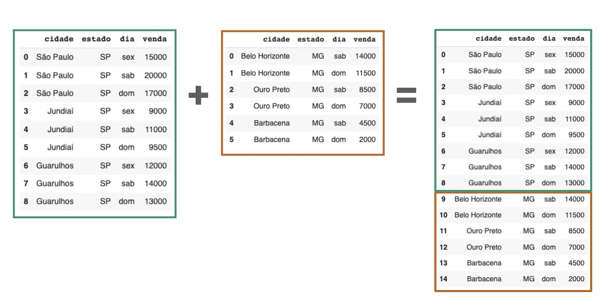

Concatenação
****

01.O que é concatenação
=====

•	**Concatenar é** o nome da técnica de empilhar um *Data Frame* sobre outro. Ou seja, **juntar dois *Data Frames*.**
•	Imagine que queremos concatenar (juntar) os dois *Data Frames* de vendas, tanto das franquias do estado de SP como de MG. Para isso, usamos o método **``concat( )``** com os seus parâmetros:
  •	**Lista de *Data Frames* na ordem a serem agrupados:
    •	Exemplo: **``[df.vendas_sp, df_vendas_mg]``**
  •	**``ignore_index``**: gera novos índices para o novo *Data Frame*.
  
.. code-block:: python
   :linenos:
   
    # CONCATENANDO DOIS DATAFRAMES
    df_vendas_totais = pd.concat([df_vendas_sp,df_vendas_mg], 
                                  ignore_index=True)
                                  
    # VISUALIZANDO O NOVO DATAFRAME df_vendas_totais
    df_vendas_totais.head(15)
    
 .. image:: VENDAS_FRANQUIAS.png
   :align: center
   :width: 400
   

02.IMPORTAR AS BIBLIOTECAS NECESSÁRIAS
====

• Para construirmos os gráficos são necessárias algumas bibliotecas:

  •  **`plotly.express`:**
    - Módulo da biblioteca **Plotly** para fazer gráficos rapidamente.
  • **`pandas`:** 
    - Biblioteca para trabalhar com dados tabulares.

.. code-block:: python
   :linenos:
   
    # IMPORTANDO AS BIBLIOTECAS NECESSÁRIAS
    import plotly.express as px
    import pandas as pd

03.IMPORTANDO OS DADOS PARA O PROJETO
====

03.a.Importando os dados.
----

• Usaremos dados dos preços da bolsa de valores para construir um gráfico de linha e **mostrar a evolução do preço das ações ao longo do tempo**.
• Você pode encontrar os dados no site do Yahoo finanças_
.. _Yahoo finanças: https://br.financas.yahoo.com/
• Criando um *DataFrame* com os dados dos preços da bolsa de valores. Neste caso, escolhemos os dados da ação da Petrobrás (PETR4).

.. code-block:: python
   :linenos:
   
    # CRIANDO O DATAFRAME COM OS DADOS DA BOLSA DE VALORES
    df = pd.read_csv("/content/PETR4.SA.csv")
    
03.b.Visualizando as primeiras linhas do *DataFrame* com o método **``head( )``**:
----
.. code-block:: python
   :linenos:
   
    # VISUALIZANDO OS DADOS DAS PRIMEIRAS LINHAS DO DATAFRAME
    df.head()
    
03.c.Dicionário de atributos.
----

- **Date**: data da cotação do preço da ação.
- **Open**: preço de abertura da ação, ou seja, o preço com que a ação começou o dia.
- **High**: preço mais alto da ação ao longo do dia.
- **Low**: preço mais baixo da ação ao longo do dia.
- **Close**: preço de fechamento, ou seja, o preço com que a ação encerrou o dia.
- **Adj Close**: preço ajustado da ação após o fechamento do mercado.
- **Volume**: volume de ações compradas/vendidas ao longo do dia.

04.CONTRUINDO O GRÁFICO DE LINHAS
====

04.a.Estrutura de gráficos Plotly Express
----

• O principal objeto da Plotly Express é a *figure* (figura em inglês).
• É dentro deste objeto *figure* que criamos os gráficos.

.. image:: PLOTLY_EXPRESS_FIGURE_GRAFICO_LINHAS.png
   :align: center
   :width: 400
   
04.b.Construindo o gráfico de linhas
----

• O primeiro passo para criar um gráfico de linhas é criar o objeto **``figura``**. 
• Para isso, usamos o método **``line( )``** com os seguintes parâmetros:
 • **``df``**: são os dados que usaremos para criar o gráfico (no caso o *DataFrame* que chamamos de **``df``**).
 • **``x``**: nome da coluna do *DataFrame* com os dados que irão para o eixo x (horizontal) do gráfico.
 • **``y``**: nome da coluna do *DataFrame* com os dados que irão para o eixo y (vertical) do gráfico.
 • **``title``**: título do gráfico.
 
.. code-block:: python
   :linenos:
   
   # CRIANDO O GRÁFICO DE LINHAS
    figura = px.line(df,
                      x='Date',
                      y='Close',
                      title='Preços das ações da Petrobrás - PETR4.')
                      
• Para mostrar o gráfico, usamos o método **``show( )``** desta forma:

.. code-block:: python
   :linenos:
   
   # MOSTRANDO O GRÁFICO
   figura.show()
   
.. image:: PLOTLY_EXPRESS_GRAFICO_DE_LINHA.png
   :align: center
   :width: 650
